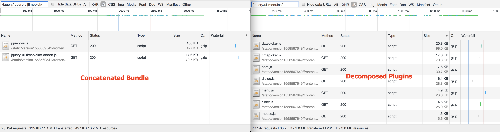

# Magento JQueryUIDecomposer Plugin

This is a hack that you probably shouldn't use in production, because I've only accounted for the home page. But it represents a change Magento core needs to make at some point: decomposing monolithic libraries down to their individual pieces.

Similar work should be done for Knockout bindings and utilities.

## How It Works
This repo comes with the non-bundled version of jQueryUI (same version as Magento 2.3). All core modules that rely on `jquery/ui` have had their dependency lists modified to import just the jQueryUI widgets they need.

If no direct import of `jquery/ui` is present on page load, only the used widgets will be loaded. If an extension or theme code has `jquery/ui` in it, this module will fall back to loading _all_ widgets, to prevent the page from breaking.

## Hacks Folder
In a real implementation, you would _not_ copy all the core JS like I've done in `view/frontend/web/hacks`. Instead we'd be making the updates in Magento core.

## Stats
Collected using `2.3-develop` branch, with Luma and `magento2-sample-data`, on the homepage of the store.

**Before**
- Compressed (gzip): 125kb
- Uncompressed: 497kb

**After**
- Compressed (gzip): 63.2kb
- Uncompressed: 281kb
